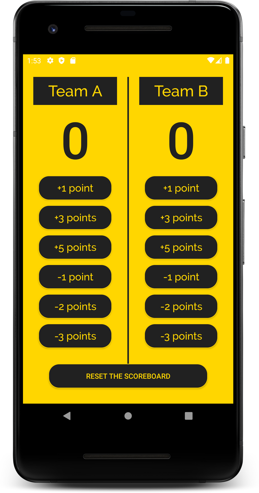
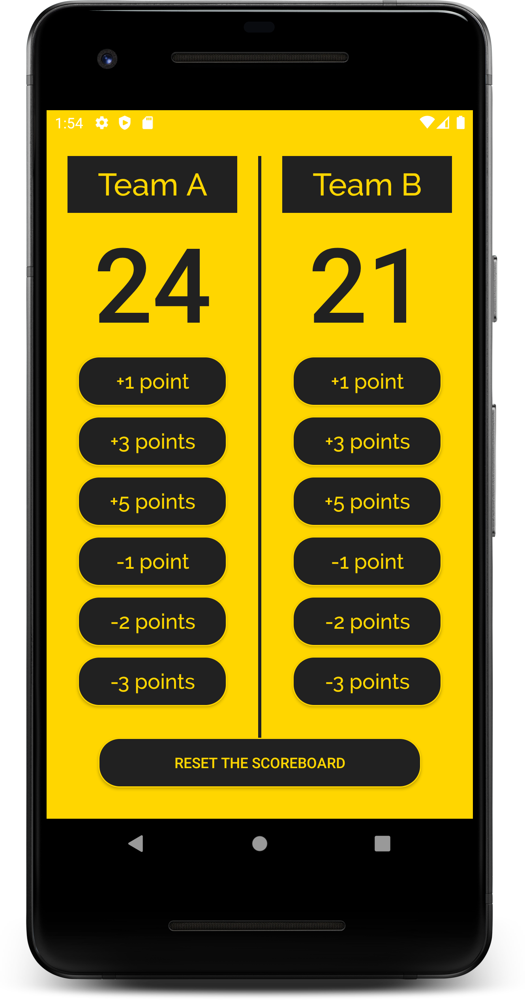

# Scorer

Forget pen and paper for maintaining a scoreline, Scorer is here.\
Scorer is an app which lets you maintain a scoreline/points of any game played between two teams/individuals. Done on the basis of points, maintain a scoreline 
in real time. From adding three types of points to even deducting three types points, this app can do it all.
And if you wish to reset the scoreline at any time, the 'RESET THE SCOREBOARD' button is there for you.

The minimum API Level of the app is 15 which means that only AVDs or Android Devices with API Level 15 or above or Android Version 4.0.3 or above will support the app.

## How to install the app in your android device?
* [app-debug.apk](https://github.com/jayesh-srivastava/Scorer-android/blob/master/apk%20file/app-debug.apk)\
Click on the above link and click on 'view raw'. You might have to grant some initial permissions to install an app from an unknown source. Install and open.

### Developed by  [@jayesh-srivastava](https://github.com/jayesh-srivastava)

&ensp; &ensp; &ensp;
